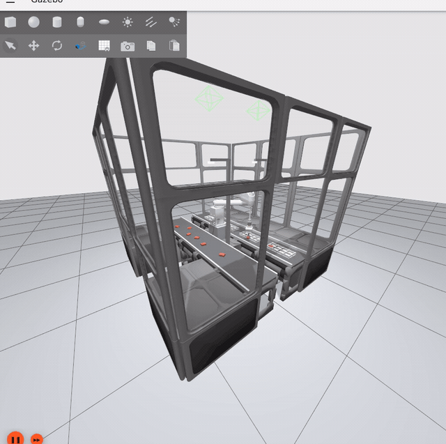

# tog-sim — vision-guided high-speed pick & place cell (ROS 2 Humble · Gazebo Fortress)

> Work in progress — an open, simulated re-interpretation of a packaging cobot *inspired by the Schubert tog.519*:
> a fast SCARA that **segments unsorted products with a neural network, checks tray pockets for vacancy,
> picks with a vacuum gripper and places into moving trays** — run from an industrial web HMI.

**Hardware modelled (all off-the-shelf):** Epson GX8-C653S SCARA · tog-sim tilt module (5th axis) · OnRobot VGC10 vacuum gripper ·
Intel RealSense D435 · Open-RMF workcell / conveyors / trays · Google Scanned Objects & YCB products.
See [THIRD_PARTY_NOTICES.md](THIRD_PARTY_NOTICES.md).


## Status

| Milestone | State |
|---|---|
| M0 Skeleton — packages, robot description, analytical IK + tests, CI | ✅ |
| M1 Sim cell — conveyors, products, trays, ros2_control in Gazebo Fortress | ✅ |
| M2 First closed loop (ground-truth perception) | ✅ 12/12 GT cycles, ~32 cpm motion-only |
| M3 Vision — synthetic data, YOLO-seg, grasp pose, tray vacancy | ✅ 600 synthetic scenes → YOLO11n-seg (mask mAP50 0.98); vs ground truth: class acc 1.00, grasp height 0.4 mm, yaw 0.8°; tray pose 4 mm / 0.05°, pocket occupancy validated (`eval_pick_poses`, `eval_tray_state`) |
| M4 Speed & moving-tray tracking, benchmark | ✅ `conveyor_tracker` (stable product/tray tracks → TF) + `TRACK_CART` picks/places on **moving belts, no belt stops**; vision benches 95–100 % success, placement mean 4–6 mm (see Benchmarks) |
| M5 HMI | 🟡 `togsim_hmi`: FastAPI + vanilla JS operator panel (status, belts, start/stop, tray occupancy) |
| M6 Polish, teach-in, stereo stretch, Docker | ⬜ |

## Demos

| Cartons only, 60 products/min, `fast` motion profile, vision perception — live from Gazebo |
|---|
|  |

Continuous vision-driven pick & place from the *moving* belts (YOLO11n-seg → pick poses → conveyor tracker →
`TRACK_CART` motions), recorded with `scripts/demo.sh vision 30` (`DEMO_CLASSES=product_carton DEMO_RATE=60.0
DEMO_PROFILE=fast DEMO_OUTFEED=0.06`): 7 cycles in the 40 s clip, the first four back-to-back at ~20 picks/min, then
waits for the next tray; products land within a few mm of the pocket centre (numbers in [Benchmarks](#benchmarks)).
The operator HMI (`http://localhost:8080`) runs alongside.

## Quick start (native)

```bash
# Ubuntu 22.04, ROS 2 Humble, Gazebo Fortress (ros-humble-ros-gz, ros-humble-ign-ros2-control)
git clone <this repo> ~/tog-sim && cd ~/tog-sim   # use a real directory (no symlinks, no spaces in the path)
./scripts/fetch_assets.sh          # third-party meshes + Fuel models
colcon build   # packages live in src/; do not use --symlink-install: Gazebo's model:// lookup does not follow symlinked model dirs
source scripts/env.sh   # in EVERY shell: own ROS_DOMAIN_ID (42), workspace overlay, GPU rendering, optional ~/togsim_data/venv
ros2 launch togsim_description view_robot.launch.py      # robot in RViz with joint sliders
ros2 launch togsim_gazebo sim.launch.py                   # full cell in Gazebo Fortress (gui:=false for headless)
ros2 launch togsim_bringup sim_full.launch.py gui:=false  # cell + controllers + vacuum + motion server (headless)
./scripts/killall.sh                                      # stop leftover tog-sim processes only (stale bridges publish /clock)
```

tog-sim uses its own `ROS_DOMAIN_ID` (default 42, override with `TOGSIM_ROS_DOMAIN_ID`) so that other ROS 2 stacks on the
same machine or LAN — in particular another Gazebo publishing `/clock` — can never mix with it.

### Vision (M3)

```bash
ros2 launch togsim_bringup sim_full.launch.py gui:=false products:=false segmentation:=true   # cell with panoptic cameras
ros2 run togsim_perception run_datagen --ros-args -p frames:=400      # resumable synthetic dataset -> ~/togsim_data/seg_v1
ros2 run togsim_perception train_seg -- --epochs 40                   # YOLO11n-seg -> ~/togsim_data/weights/togsim_seg.pt
ros2 launch togsim_bringup sim_full.launch.py gui:=false          # populated cell (segmentation:=true only needed for datagen)
ros2 launch togsim_perception perception.launch.py                    # segmentation + pick poses + tray vacancy
ros2 run togsim_perception eval_pick_poses --ros-args -p use_sim_time:=true   # vision vs ground truth metrics
ros2 run togsim_task run_cycle --ros-args -p perception:=vision -p use_sim_time:=true
```

Note: ultralytics treats numpy images as BGR - the nodes convert the ROS `rgb8` frames before inference (training PNGs are BGR).

GPU: install a `torch` build matching the NVIDIA driver into `~/togsim_data/venv` (`python3 -m venv --system-site-packages`,
e.g. `pip install torch torchvision --index-url https://download.pytorch.org/whl/cu128` for driver 535); `scripts/env.sh`
activates it when present and the nodes pick CUDA automatically (`device:=auto`).

## Benchmarks

`scripts/bench.sh <name> [repeats] [cycles] [vision|gt]` runs seeded repeats of `scripts/m4_validate.sh` and writes one JSON
per run (cycles, attempts, cpm, motion time, placement mean/p95 from ground truth, per-phase timeline, failures).
Placement = released product vs the centre of the pocket it sits in (ground truth); the pocket clearance is 5 mm per side.

| scenario (vision) | success | cpm | placement mean | p95 | yaw |
|---|---|---|---|---|---|
| cartons only, 60/min, `fast` profile, belts 0.10 m/s | 20/20, 20/21 | 10–14 | 4–6 mm | 5–12 mm | ~2° |
| bars + cartons, 24/min, `smooth` profile | 20/21, 20/24 | 5–6 (carton arrivals 12/min) | 5–6 mm | 6–20 mm | 2–3° |
| cartons only, 60/min, `fast`, **outfeed 0.06 m/s** (`M4_OUTFEED=0.06`, `outfeed_speed` param) | 20/22, 20/20 | 10–14.5 | 2.4–3.3 mm | 6.7–6.9 mm | 1–2° |

Motion profiles (`motion_profile:=fast|smooth`, `scripts/joint_metrics.py` samples `/joint_states`, cartons 60/min):

| profile | cpm | motion / cycle | acc p95 J1/J2/J4 (rad/s²) | jerk p95 J1/J2/J4 (rad/s³) |
|---|---|---|---|---|
| fast | 7–10 | 3.2–4.2 s | 40 / 45 / 51 | 457 / 491 / 1391 |
| smooth | 6–7 | 4.4–4.5 s | 22 / 26 / 33 | 213 / 223 / 833 |

What made the difference (details in the commit log): tracked segments settle on the *measured* arm including the
heading, the place approach clears the pocket walls, the grasp offset is measured at the seal and compensated at the
place, tray tracks are dead-reckoned on a shared belt-speed estimate (objects slip ~10 % on the belts) and observations
taken while the arm is over a tray are ignored. Throughput is bounded by the tray window: a tray is placeable for
~3 s of its passage at 0.10 m/s, so cycles of ~3 s allow one or two placements per tray; a slower outfeed (0.06 m/s)
widens the window and also improves precision (last row).

Several tray models can share the outfeed (`tray_models:=tray_2x4,tray_bar_2x3` on `sim_full.launch.py` and
`perception.launch.py`): the vacancy node picks the spec per mask from the pocket size and `run_cycle` places each
product class only into a fitting tray. The 620 mm bar tray is longer than the place camera's view, so it is only
placeable while fully visible (partial-tray lattice pose: open item).

## Operator HMI (M5)

```bash
ros2 launch togsim_hmi hmi.launch.py port:=8080        # with the cell running; scripts/demo.sh starts it too
# http://localhost:8080 : state / cycles / rate / success / placement, belt speed sliders, start-stop of the
# continuous pick & place (vision or ground truth), tray occupancy grid, pickable products, events, run_cycle log
```

The panel talks to a small rclpy bridge (`/togsim/hmi/status` from `run_cycle`, tracked trays/products, vacuum, joints,
belt `cmd_vel`) through `GET /api/state`, `POST /api/belts`, `POST /api/run`, `POST /api/stop`.

## Packages

| Package | Role |
|---|---|
| `src/togsim_msgs` | Interfaces (`PickCandidate`, `TrayState`, `VacuumState`, `CycleEvent`, `Kpi`, `ExecuteMotion` action …) |
| `src/togsim_description` | Epson GX8-C653S + tilt module + VGC10 xacros, limits, RViz launch |
| `src/togsim_gazebo` | Fortress world, product/tray models, **custom vacuum gripper system plugin**, spawner |
| `src/togsim_control` | ros2_control controllers, vacuum bridge |
| `src/togsim_motion` | Analytical SCARA IK, Ruckig 500 Hz streaming, `ExecuteMotion` server, conveyor tracker |
| `src/togsim_perception` | Synthetic dataset generation, YOLO-seg training/inference, grasp pose, tray vacancy, teach-in |
| `src/togsim_task` | Lifecycle FSM + py_trees pick/place cycle, KPIs, benchmark |
| `src/togsim_hmi` | FastAPI + vanilla JS operator HMI |
| `src/togsim_bringup` | Top-level launch files, Docker |

## Licence

Apache-2.0 (see `LICENSE`). Third-party assets keep their own licences (`THIRD_PARTY_NOTICES.md`).
