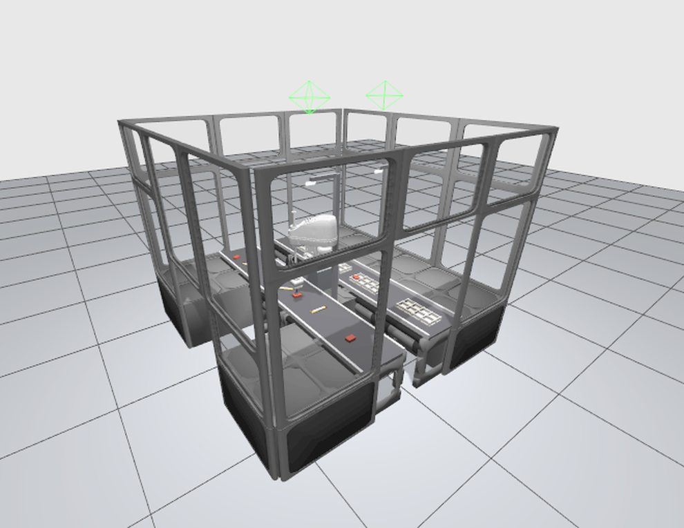
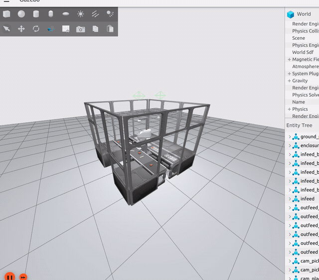

# tog-sim — vision-guided high-speed pick & place cell (ROS 2 Humble · Gazebo Fortress)

> Work in progress — an open, simulated re-interpretation of a packaging cobot *inspired by the Schubert tog.519*:
> a fast SCARA that **segments unsorted products with a neural network, checks tray pockets for vacancy,
> picks with a vacuum gripper and places into moving trays** — run from an industrial web HMI.

**Hardware modelled (all off-the-shelf):** Epson GX8-C653S SCARA · tog-sim tilt module (5th axis) · OnRobot VGC10 vacuum gripper ·
Intel RealSense D435 · Open-RMF workcell / conveyors / trays · Google Scanned Objects & YCB products.
See [THIRD_PARTY_NOTICES.md](THIRD_PARTY_NOTICES.md).



## Status

| Milestone | State |
|---|---|
| M0 Skeleton — packages, robot description, analytical IK + tests, CI | ✅ |
| M1 Sim cell — conveyors, products, trays, ros2_control in Gazebo Fortress | ✅ |
| M2 First closed loop (ground-truth perception) | ✅ 12/12 GT cycles, ~32 cpm motion-only |
| M3 Vision — synthetic data, YOLO-seg, grasp pose, tray vacancy | 🟡 600 synthetic scenes → YOLO11n-seg mask mAP50 0.98; vs ground truth: class acc 1.00, recall 0.92, precision 0.94, grasp height 0.4 mm, yaw 0.8°; **12/13 vision-driven cycles** (`scripts/m3_validate.sh`). Open: GIF, tray-vacancy metrics |
| M4 Speed & moving-tray tracking, benchmark | 🟡 `conveyor_tracker` (stable product/tray tracks → TF) + `TRACK_CART` picks/places on **moving belts, no belt stops**: GT 12/13, vision **20/24** cycles (`scripts/m4_validate.sh 20 vision`), motion 4.4 s/cycle. Open: cycle time (target ≤2.5 s), bars → `tray_bar_2x3`, seal misses (3/24), benchmark table |
| M5 HMI | ⬜ |
| M6 Polish, teach-in, stereo stretch, Docker | ⬜ |

## Demos

| Continuous vision-driven pick & place from the *moving* belts |
|---|
|  |

YOLO11n-seg → pick poses → conveyor tracker → `TRACK_CART` motions, recorded live from Gazebo. Placement accuracy
(product vs pocket centre, ground truth): GT perception 8.6 mm / 0.2°, vision 14.6 mm / 3.7° (10/10 cycles).

## Quick start (native)

```bash
# Ubuntu 22.04, ROS 2 Humble, Gazebo Fortress (ros-humble-ros-gz, ros-humble-ign-ros2-control)
git clone <this repo> ~/tog-sim && cd ~/tog-sim   # use a real directory (no symlinks, no spaces in the path)
./scripts/fetch_assets.sh          # third-party meshes + Fuel models
colcon build   # packages live in src/; do not use --symlink-install: Gazebo's model:// lookup does not follow symlinked model dirs
source scripts/env.sh   # in EVERY shell: own ROS_DOMAIN_ID (42), workspace overlay, GPU rendering, optional ~/togsim_data/venv
ros2 launch togsim_description view_robot.launch.py      # robot in RViz with joint sliders
ros2 launch togsim_gazebo sim.launch.py                   # full cell in Gazebo Fortress (gui:=false for headless)
ros2 launch togsim_bringup sim_full.launch.py gui:=false  # cell + controllers + vacuum + motion server (headless)
./scripts/killall.sh                                      # stop leftover tog-sim processes only (stale bridges publish /clock)
```

tog-sim uses its own `ROS_DOMAIN_ID` (default 42, override with `TOGSIM_ROS_DOMAIN_ID`) so that other ROS 2 stacks on the
same machine or LAN — in particular another Gazebo publishing `/clock` — can never mix with it.

### Vision (M3)

```bash
ros2 launch togsim_bringup sim_full.launch.py gui:=false products:=false segmentation:=true   # cell with panoptic cameras
ros2 run togsim_perception run_datagen --ros-args -p frames:=400      # resumable synthetic dataset -> ~/togsim_data/seg_v1
ros2 run togsim_perception train_seg -- --epochs 40                   # YOLO11n-seg -> ~/togsim_data/weights/togsim_seg.pt
ros2 launch togsim_bringup sim_full.launch.py gui:=false          # populated cell (segmentation:=true only needed for datagen)
ros2 launch togsim_perception perception.launch.py                    # segmentation + pick poses + tray vacancy
ros2 run togsim_perception eval_pick_poses --ros-args -p use_sim_time:=true   # vision vs ground truth metrics
ros2 run togsim_task run_cycle --ros-args -p perception:=vision -p use_sim_time:=true
```

Note: ultralytics treats numpy images as BGR - the nodes convert the ROS `rgb8` frames before inference (training PNGs are BGR).

GPU: install a `torch` build matching the NVIDIA driver into `~/togsim_data/venv` (`python3 -m venv --system-site-packages`,
e.g. `pip install torch torchvision --index-url https://download.pytorch.org/whl/cu128` for driver 535); `scripts/env.sh`
activates it when present and the nodes pick CUDA automatically (`device:=auto`).

## Packages

| Package | Role |
|---|---|
| `src/togsim_msgs` | Interfaces (`PickCandidate`, `TrayState`, `VacuumState`, `CycleEvent`, `Kpi`, `ExecuteMotion` action …) |
| `src/togsim_description` | Epson GX8-C653S + tilt module + VGC10 xacros, limits, RViz launch |
| `src/togsim_gazebo` | Fortress world, product/tray models, **custom vacuum gripper system plugin**, spawner |
| `src/togsim_control` | ros2_control controllers, vacuum bridge |
| `src/togsim_motion` | Analytical SCARA IK, Ruckig 500 Hz streaming, `ExecuteMotion` server, conveyor tracker |
| `src/togsim_perception` | Synthetic dataset generation, YOLO-seg training/inference, grasp pose, tray vacancy, teach-in |
| `src/togsim_task` | Lifecycle FSM + py_trees pick/place cycle, KPIs, benchmark |
| `src/togsim_hmi` | FastAPI + vanilla JS operator HMI |
| `src/togsim_bringup` | Top-level launch files, Docker |

## Licence

Apache-2.0 (see `LICENSE`). Third-party assets keep their own licences (`THIRD_PARTY_NOTICES.md`).
